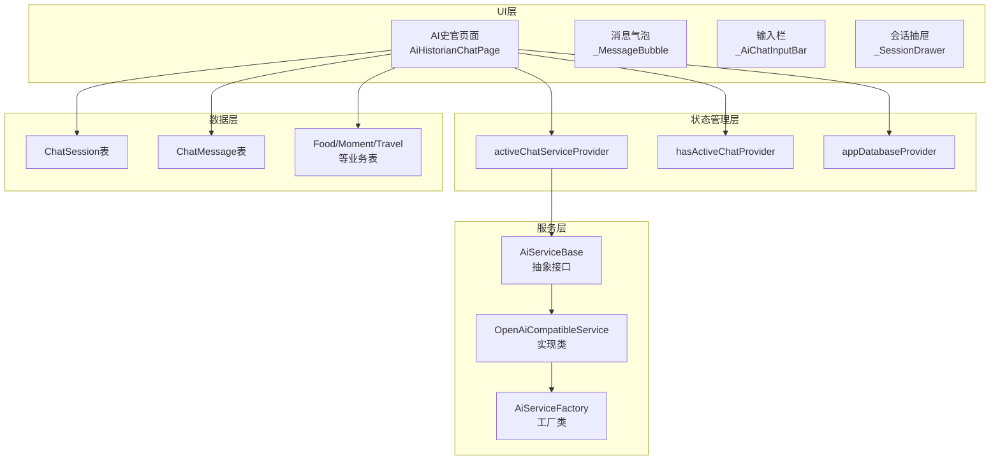
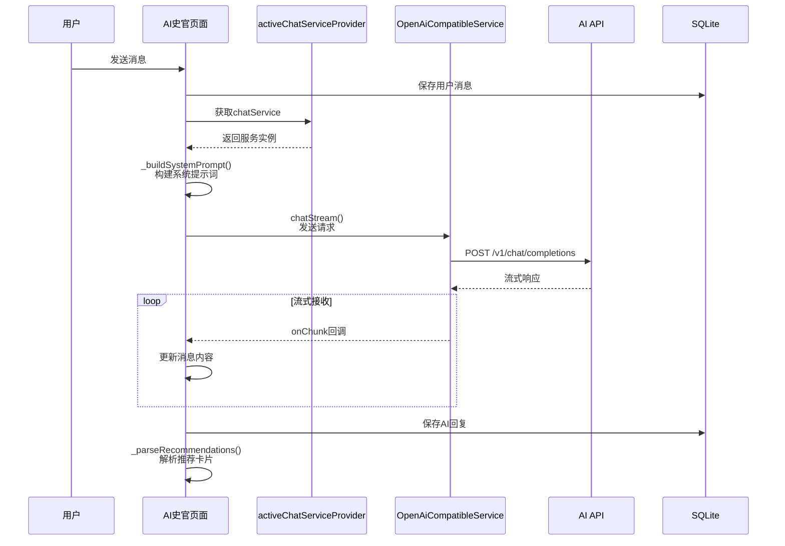
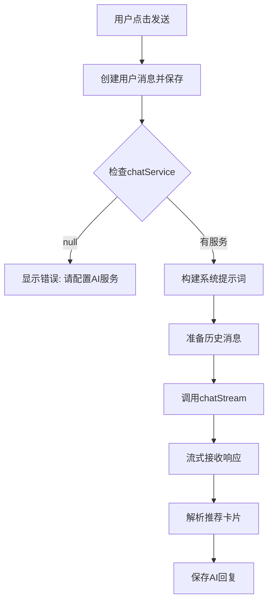
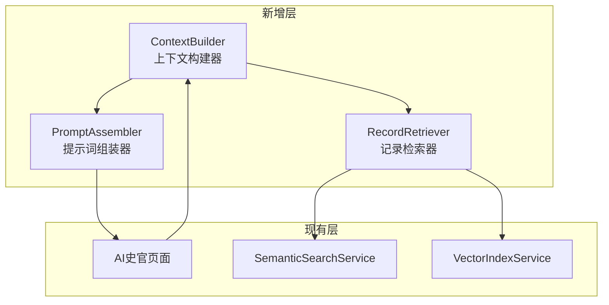
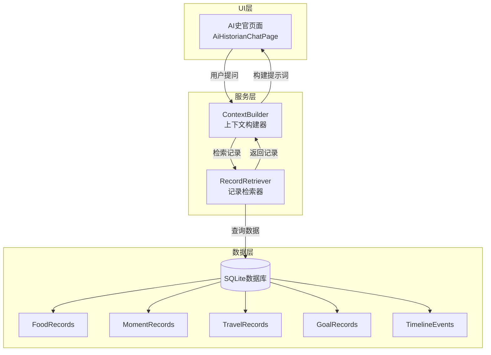

# AI史官技术设计文档

## 一、概述

AI史官是人生编年史APP的智能对话助手，基于用户的人生记录数据（美食、小确幸、旅行、目标、相遇等），提供温暖的回顾和洞察服务。

### 核心功能
- **智能对话**：基于OpenAI兼容API的流式对话
- **数据统计**：自动统计用户各模块记录数量
- **快捷指令**：支持"总结上月心情"、"分析年度目标进度"、"那年今日"等快捷提问
- **推荐卡片**：AI可以推荐相关记录，以卡片形式展示
- **会话管理**：支持多会话历史，可切换和删除

---

## 二、架构设计

### 2.1 整体架构



### 2.2 数据流向



---

## 三、核心组件详解

### 3.1 AI史官页面 (AiHistorianChatPage)

**文件路径**: `lib/features/ai_historian/presentation/ai_historian_chat_page.dart`

**核心状态**:
```dart
class _AiHistorianChatPageState extends ConsumerState<AiHistorianChatPage> {
  final List<ChatMessageModel> _messages = [];  // 消息列表
  bool _isLoading = false;                       // 加载状态
  String? _errorMessage;                         // 错误信息
  int _totalRecords = 0;                         // 总记录数
  Map<String, int> _recordStats = {};            // 各模块统计
  String? _currentSessionId;                     // 当前会话ID
  bool _isInitialized = false;                   // 初始化状态
}
```

**生命周期**:
1. `initState()` → `_loadRecordStats()` + `_initializeSession()`
2. `_initializeSession()` → 加载或创建会话 → 加载历史消息 → `_addWelcomeMessage()`
3. 首次欢迎消息包含统计信息："我已经阅读了你的人生档案，包含 $_totalRecords 条记录"

### 3.2 系统提示词构建 (_buildSystemPrompt)

**当前实现** (第265-291行):

```dart
String _buildSystemPrompt() {
  final buffer = StringBuffer();
  buffer.writeln('你是人生编年史APP的AI史官...');
  buffer.writeln('## 用户数据统计');
  buffer.writeln('- 美食记录：${_recordStats['food'] ?? 0} 条');
  buffer.writeln('- 小确幸记录：${_recordStats['moment'] ?? 0} 条');
  buffer.writeln('- 旅行记录：${_recordStats['travel'] ?? 0} 条');
  buffer.writeln('- 目标记录：${_recordStats['goal'] ?? 0} 条');
  buffer.writeln('- 相遇记录：${_recordStats['encounter'] ?? 0} 条');
  buffer.writeln('- 总计：$_totalRecords 条记录');
  buffer.writeln('## 回复原则');
  // ... 回复原则
  buffer.writeln('## 推荐卡片格式');
  // ... JSON格式说明
  return buffer.toString();
}
```

**关键问题**: 系统提示词**只包含统计数据**，不包含具体的记录内容！

### 3.3 消息发送流程 (_sendMessage)



**历史消息准备** (第371-378行):
```dart
final history = _messages
    .where((m) => m.id != aiMessageId)           // 排除当前AI消息
    .where((m) => !m.id.startsWith('welcome_'))  // 排除欢迎消息
    .map((m) => ai_service.ChatMessage(
          role: m.role == MessageRole.user ? 'user' : 'assistant',
          content: m.content,
        ))
    .toList();
```

### 3.4 快捷指令实现

**三个快捷指令按钮** (第946-965行):

```dart
_SuggestionChip(
  label: '总结上月心情',
  onTap: () => onQuickMessage('请帮我总结一下上个月的心情变化'),
),
_SuggestionChip(
  label: '分析年度目标进度',
  onTap: () => onQuickMessage('请分析一下我今年的目标完成进度'),
),
_SuggestionChip(
  label: '那年今日',
  onTap: () => onQuickMessage('那年今天我做了什么？'),
)
```

**实现方式**: 只是预填充文本，点击后调用 `_sendMessage()`，没有特殊的上下文处理。

---

## 四、数据检索系统

### 4.1 当前数据流分析

**AI史官实际加载的数据**:

| 数据类型 | 是否加载 | 说明 |
|---------|---------|------|
| 记录总数统计 | ✅ | _loadRecordStats() 加载 |
| 各模块数量 | ✅ | food/moment/travel/goal/encounter |
| 具体记录内容 | ❌ | **没有加载** |
| 向量索引 | ❌ | 未集成到AI史官 |
| 全文检索 | ❌ | 未集成到AI史官 |

### 4.2 语义搜索服务 (SemanticSearchService)

**文件**: `lib/core/services/semantic_search_service.dart`

**功能**:
- `search()`: 基于向量相似度的语义搜索
- `hybridSearch()`: 语义搜索 + 关键词搜索的混合搜索
- `_keywordSearch()`: 基于FTS5的全文检索

**问题**: 这个服务**没有被AI史官使用**！

### 4.3 向量索引系统

**组件**:
- `VectorIndexManager`: 管理器
- `VectorIndexService`: 向量索引服务
- `VectorIndexTrigger`: 自动触发器（记录增删改时自动更新向量）

**问题**: 向量系统虽然存在，但**AI史官没有调用**它来检索相关记录。

---

## 五、问题分析

### 5.1 "没有加载全部内容"的根本原因

**问题定位**: AI史官页面**只加载了统计数据**，没有加载用户的具体记录内容。

**证据**:
1. `_loadRecordStats()` 只统计数量，不读取内容
2. `_buildSystemPrompt()` 只包含统计数字
3. 没有调用 `SemanticSearchService` 或 `VectorIndexService`
4. 发送给AI的上下文只有历史对话，没有相关记录

**当前系统提示词示例**:
```
你是人生编年史APP的AI史官...

## 用户数据统计
- 美食记录：15 条
- 小确幸记录：23 条
- 旅行记录：8 条
- 目标记录：12 条
- 相遇记录：5 条
- 总计：63 条记录

## 回复原则
...
```

**缺失的内容**:
- 具体的美食记录（吃了什么、在哪里、评价如何）
- 小确幸的具体内容
- 旅行的详细行程
- 目标的完成情况
- 相遇的人物和场景

### 5.2 其他发现的问题

| 问题 | 严重程度 | 说明 |
|------|---------|------|
| 快捷指令无上下文 | 中 | "那年今日"应该自动查询历史数据，但实际只是发送文本 |
| 推荐卡片依赖AI生成 | 低 | AI可能不返回正确的JSON格式 |
| 无实时数据检索 | 高 | 用户提问时，没有检索相关记录作为上下文 |
| 会话标题固定 | 低 | 所有新会话都叫"新对话" |

---

## 六、优化建议

### 6.1 核心优化：注入相关记录到上下文

**方案A: 基于向量检索的RAG** (推荐)

```dart
Future<String> _buildSystemPromptWithContext(String userQuery) async {
  final buffer = StringBuffer();
  
  // 1. 基础角色定义
  buffer.writeln('你是人生编年史APP的AI史官...');
  buffer.writeln(_buildStatsSection()); // 统计数据
  
  // 2. 检索相关记录 (NEW!)
  final searchResults = await _semanticSearchService.search(
    query: userQuery,
    limit: 5,
  );
  
  if (searchResults.isNotEmpty) {
    buffer.writeln('## 相关记录');
    for (final result in searchResults) {
      buffer.writeln(_formatRecord(result));
    }
  }
  
  buffer.writeln('## 回复原则');
  // ...
  
  return buffer.toString();
}
```

**方案B: 快捷指令特殊处理**

```dart
void _sendQuickMessage(String type) async {
  String message;
  List<Map<String, dynamic>> contextData;
  
  switch (type) {
    case 'mood_summary':
      message = '请帮我总结一下上个月的心情变化';
      contextData = await _loadLastMonthMoments(); // 加载具体数据
      break;
    case 'on_this_day':
      message = '那年今天我做了什么？';
      contextData = await _loadOnThisDayRecords(); // 加载历史今日数据
      break;
    // ...
  }
  
  _sendMessageWithContext(message, contextData);
}
```

### 6.2 架构改进建议



### 6.3 具体实现步骤

1. **创建ContextBuilder类**
   - 封装上下文构建逻辑
   - 集成语义搜索
   - 支持不同查询类型的特殊处理

2. **修改_sendMessage方法**
   - 在发送前调用ContextBuilder
   - 将检索到的记录注入系统提示词

3. **优化快捷指令**
   - 为每个快捷指令实现专门的数据查询
   - 预加载相关记录作为上下文

4. **添加缓存机制**
   - 缓存最近检索的结果
   - 避免重复查询数据库

---

## 七、总结

### 当前状态
AI史官的基础架构完整，可以正常对话，但**缺乏与真实记录数据的深度集成**。系统提示词只包含统计数字，AI无法了解用户的具体内容。

### 核心问题
**AI史官没有"记忆"用户的具体记录**，只能看到"你有15条美食记录"，但不知道"你在2024年1月1日在上海吃了小笼包，评价4.5星"。

### 解决方向
需要实现**RAG (Retrieval-Augmented Generation)** 架构，在用户提问时，先检索相关记录，再将记录内容注入到系统提示词中，让AI基于真实数据回答问题。

### 优先级
1. 🔴 **高**: 集成语义搜索，注入相关记录到上下文 ✅ **已完成**
2. 🟡 **中**: 优化快捷指令，实现真正的数据查询 ✅ **已完成**
3. 🟢 **低**: 优化UI细节（会话标题自动生成等）

---

## 八、优化实现状态（2026-03-09更新）

### 8.1 已完成的优化

#### ✅ RecordRetriever服务
**文件**: `lib/features/ai_historian/services/record_retriever.dart`

**功能**:
- 支持5种查询类型：`summary`, `query`, `timeRange`, `statistics`, `onThisDay`
- 全量模块数据加载（美食、小确幸、旅行、目标、相遇）
- 时间范围查询
- 关键词搜索
- "那年今日"历史日期查询

**核心方法**:
```dart
Future<List<RecordContext>> retrieveRecords({
  required QueryType queryType,
  required String userQuery,
  String? module,
  DateTime? startDate,
  DateTime? endDate,
  int limit = 20,
})
```

#### ✅ ContextBuilder服务
**文件**: `lib/features/ai_historian/services/context_builder.dart`

**功能**:
- 问题分类器：根据问题类型选择检索策略
- 记录检索器：调用RecordRetriever获取数据
- 提示词组装器：动态注入相关记录到系统提示词
- 快捷指令支持：为特定场景预加载数据

**核心方法**:
```dart
Future<String> buildSystemPrompt({
  required String userQuery,
  required Map<String, int> recordStats,
  required int totalRecords,
  List<RecordContext>? preloadedRecords,
})

Future<List<RecordContext>> retrieveForQuickAction(String actionType)
```

#### ✅ AI史官页面集成
**文件**: `lib/features/ai_historian/presentation/ai_historian_chat_page.dart`

**修改内容**:
1. 导入ContextBuilder和RecordRetriever
2. `_sendMessage`方法集成ContextBuilder
3. 新增`_sendQuickMessageWithContext`方法
4. 快捷指令使用新方法预加载数据

### 8.2 数据注入效果

**优化前**:
```
用户：我吃过什么好吃的？
AI：根据你的数据，你有15条美食记录。但我不知道具体吃了什么...
```

**优化后**:
```
用户：我吃过什么好吃的？
AI：根据你的记录，你吃过很多美食呢！

1. 2024年1月15日在上海吃了小笼包，评价4.5星
2. 2024年2月20日在北京吃了烤鸭，评价5星
3. 2024年3月10日在成都吃了火锅，评价4星
...

你最喜欢的似乎是川菜，有3次火锅记录！
```

### 8.3 架构图（已实现）



### 8.4 待优化项

| 项目 | 优先级 | 说明 |
|------|--------|------|
| Token估算与控制 | 中 | 防止上下文过长导致API调用失败 |
| 缓存机制 | 中 | 缓存最近检索结果，避免重复查询 |
| 会话标题自动生成 | 低 | 根据对话内容自动生成标题 |
| 推荐卡片解析优化 | 低 | 增强JSON解析容错性 |
